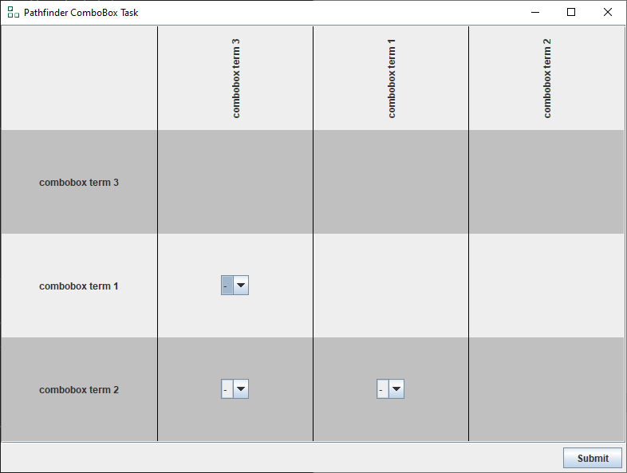
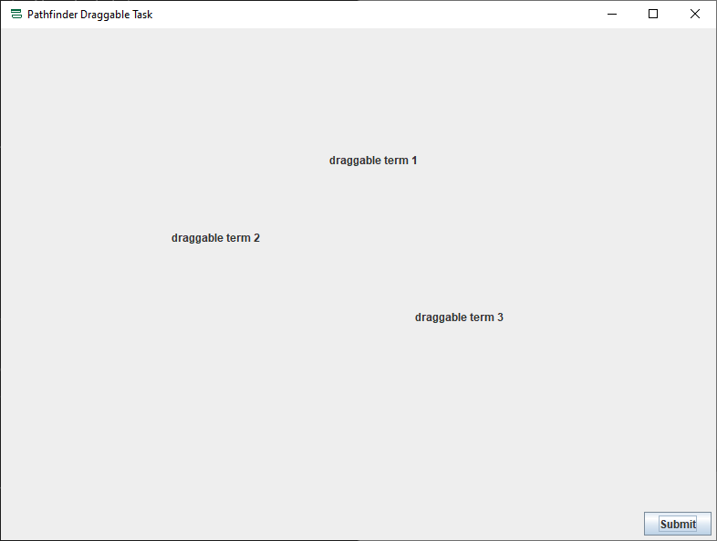
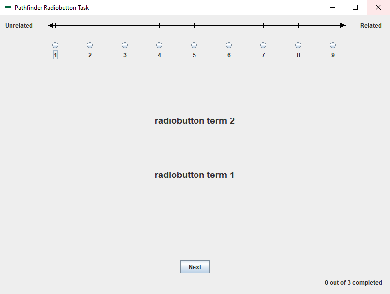
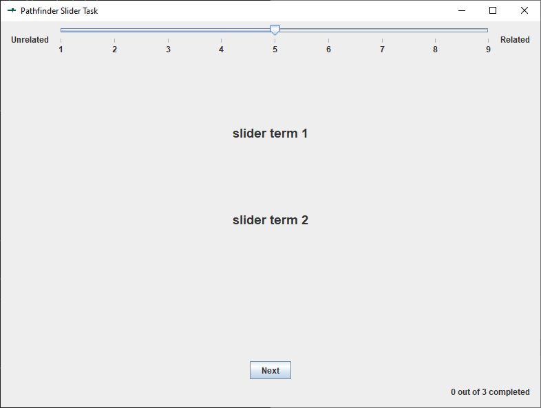
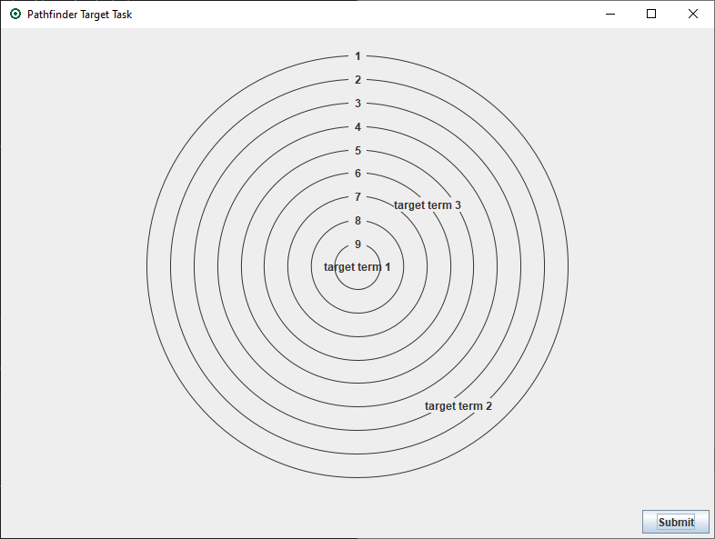

## Pathfinder 

## Overview

Pathfinder is a Java-based suite of tools for working with [Pathfinder
networks](https://en.wikipedia.org/wiki/Pathfinder_network).

At present the suite consists of five data collection applications. The
function of each data collection application is to collect proximity
ratings for all possible pairings of terms from a predefined list. The
collected ratings are written to disk in a format compatible with
JPathfinder analysis software distributed by
[Interlink](https://research-collective.com/PFWeb/Download.html),
including additional metadata such as the date and total elapsed time
(in milliseconds) of the rating session.

## Installation

Precompiled executables are available for Windows, Linux, and MacOS in
[releases](https://github.com/the-mad-statter/Pathfinder/releases).

If you wish to build from source, first ensure you have properly
installed the necessary prerequisites:

1.  [Java SE Development Kit 23 (JDK
    23)](https://www.oracle.com/java/technologies/javase/jdk23-archive-downloads.html)
2.  [Apache Maven](https://maven.apache.org/)
3.  [Git](https://git-scm.com/downloads)

Then clone this repository and package with Maven:

    git clone https://github.com/the-mad-statter/Pathfinder.git
    cd Pathfinder
    mvn package

The above commands should produce distribution files under
`target/dist/Pathfinder`.

## Configuration

Each application utilizes a settings file in
[JSON](https://en.wikipedia.org/wiki/JSON) format. Example files are
provided in the distribution. While specific settings may vary from
application to application, important, common settings include:

1.  “terms”
    - a JSON array of terms, pairs of which will be rated
2.  “instructions”
    - a JSON array of initial instructions for participants
3.  “debriefing”
    - a JSON array of final instructions shown upon task completion

## Rating Task Descriptions

Each task progresses through four steps (i.e., ID, Instructions, Task,
and Debrief).

### ID

Upon launching any given data collection application, participants are
prompted to enter an identification code consisting of any alphanumeric
characters. They are then required to re-enter the code for
verification. If the two entries do not match, the participant is
prompted to try again until a valid match is made. This step prevents
input errors and ensures consistency, as the ID is used as the data file
name.

If a file with the entered ID already exists (e.g., `foobar.prx`), the
software automatically appends a number to create a unique filename
(`foobar1.prx`, `foobar2.prx`, etc.).

### Instructions

Once the ID is confirmed, the participant views the starting
instructions followed by the rating task.

### Task

#### ComboBox

In the ComboBox task, all terms are presented on the screen in a
grid-like fashion. Where one term’s row and another term’s column
intersects, participants indicate their rating with a pull-down box.

#### Draggable

In the Draggable task, all terms are presented randomly on screen.
Participants indicate their ratings by dragging like terms closer
together and disparate terms further apart.

#### RadioButton

In the RadioButton task, participants are shown two terms at a time and
indicate their rating with radio buttons.

#### Slider

The Slider task is similar to the RadioButton task, but a slider is used
instead of radio buttons.

#### Target

The Target task is similar to the Draggable task, but there is a
circular target with a central bullseye. The task consists of n − 1
rounds, where n is the number of terms. In each round one term is
randomly selected and placed in the bullseye as the anchor term while
other terms are displayed in random positions around the target. After a
term has been used as an anchor, it will not be included in future
rounds, and the next round selects a new anchor from the remaining
terms. This continues until all pairwise relationships have been
assessed through n − 1 rounds.

### Debrief

After the rating task is completed, the debriefing instructions are
presented in the same manner as the introductory instructions.

## About The Mad Statter 

[The Mad Statter](https://www.themadstatter.com) is a premier
statistical consulting and programming firm dedicated to delivering
rigorous, data-driven solutions tailored to meet the unique needs of
researchers, businesses, and organizations. Combining deep expertise in
statistics, advanced programming skills, and industry best practices,
The Mad Statter empowers clients to unlock insights, optimize
decision-making, and drive impactful outcomes.

Our services span study design, data management, statistical analysis,
predictive modeling, and visualization, leveraging a wide range of
software platforms and programming languages. Whether supporting
academic research, clinical trials, market research, or operational
analytics, The Mad Statter provides clear, actionable results with an
emphasis on quality, transparency, and collaboration.

At The Mad Statter, we are passionate about transforming complex data
challenges into streamlined, understandable solutions helping you make
smarter decisions with confidence.
